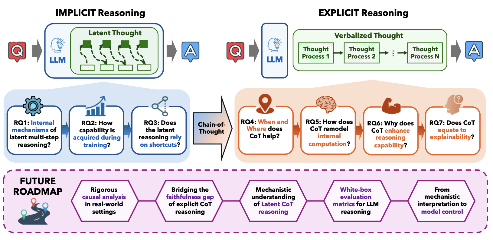

# Opening the Black Box: A Survey on the Mechanisms of Multi-Step Reasoning in Large Language Models

[](https://awesome.re) 
[](https://opensource.org/licenses/MIT)

> **A comprehensive overview of the mechanisms underlying LLM multi-step reasoning, spanning from implicit latent reasoning to explicit chain-of-thought reasoning.** [[PDF]](https://arxiv.org/abs/2601.14270)

## 📖 Table of Contents

- [Overview](#-overview)
- [Latest News](#-latest-news)
- [Taxonomy & Framework](#-taxonomy--framework)
- [Paper List](#-paper-list)
  - [1. Implicit Multi-Step Reasoning](#1-implicit-multi-step-reasoning)
    - [Internal Mechanisms](#internal-mechanisms)
    - [Training Acquisition](#training-acquisition)
    - [Shortcuts](#shortcuts)
  - [2. Explicit Multi-Step Reasoning](#2-explicit-multi-step-reasoning)
    - [When and Where CoT Helps](#when-and-where-cot-helps)
    - [Internal Computation Remodeling](#internal-computation-remodeling)
    - [Why CoT Enhances Reasoning](#why-cot-enhances-reasoning)
    - [CoT Explainability](#explainability)

## 📖 Overview



Large Language Models (LLMs) have demonstrated remarkable abilities to solve problems requiring multiple reasoning steps. Unlike existing surveys that primarily focus on engineering methods to enhance performance, this survey provides a comprehensive overview of the **mechanisms** underlying LLM multi-step reasoning.

We organize the survey around a cognitive framework comprising seven interconnected research questions, moving from how LLMs execute **implicit multi-hop reasoning** within hidden activations to how verbalized **explicit reasoning** (Chain-of-Thought) remodels internal computation.

## 🔥 Latest News

- **[2026-01-09]** This repository is created to track the latest progress in the mechanistic understanding of LLM multi-step reasoning.

## 🏷 Taxonomy & Framework

To help navigate the paper list, we organize studies around the **seven interconnected Research Questions (RQs)** proposed in our survey:

### 🧠 Implicit Reasoning

The process where multi-hop inference is performed entirely within the model's hidden activations.

- **RQ1: What are the internal mechanisms of latent multi-step reasoning?**
- **RQ2: How latent multi-step reasoning capability is acquired during training?**
- **RQ3: To what extent does multi-step reasoning rely on shortcuts?**

### 🗣️ Explicit Reasoning

The process where the model externalizes the reasoning process into a sequence of natural language tokens (Chain-of-Thought).

- **RQ4: Where and When Does CoT Help?**
- **RQ5: How Does Chain-of-Thought Remodel Internal Computation?**
- **RQ6: Why CoT Enhances Reasoning Abilities?**
- **RQ7: Does Chain-of-Thought Equate to Explainability?**

---

## 📑 Paper List

### 1. Implicit Multi-Step Reasoning

#### RQ1: What are the internal mechanisms of latent multi-step reasoning?

| Paper                                                        |    Venue     | Year |                             Link                             |
| :----------------------------------------------------------- | :----------: | :--: | :----------------------------------------------------------: |
| **Do Large Language Models Latently Perform Multi-Hop Reasoning?** |     ACL      | 2024 |    [Link](https://doi.org/10.18653/v1/2024.acl-long.550)     |
| **Hopping Too Late: Exploring the Limitations of Large Language Models on Multi-Hop Queries** |    EMNLP     | 2024 |   [Link](https://doi.org/10.18653/v1/2024.emnlp-main.781)    |
| **A Mechanistic Analysis of a Transformer Trained on a Symbolic Multi-Step Reasoning Task** | ACL Findings | 2024 |  [Link](https://doi.org/10.18653/v1/2024.findings-acl.242)   |
| **Patchscopes: A Unifying Framework for Inspecting Hidden Representations of Language Models** |     ICML     | 2024 |      [Link](https://openreview.net/forum?id=5uwBzcn885)      |
| **Understanding and Patching Compositional Reasoning in LLMs** | ACL Findings | 2024 |  [Link](https://doi.org/10.18653/v1/2024.findings-acl.576)   |
| **interpreting GPT: the logit lens**                         |  LessWrong   | 2020 | [Link](https://www.lesswrong.com/posts/AcKRB8wDpdaN6v6ru/interpreting-gpt-the-logit-lens) |
| **Back Attention: Understanding and Enhancing Multi-Hop Reasoning in Large Language Models** |    ArXiv     | 2025 |      [Link](https://doi.org/10.48550/arXiv.2502.10835)       |
| **Internal Chain-of-Thought: Empirical Evidence for Layer-wise Subtask Scheduling in LLMs** |    ArXiv     | 2025 |      [Link](https://doi.org/10.48550/arXiv.2505.14530)       |
| **Towards a Mechanistic Interpretation of Multi-Step Reasoning Capabilities of Language Models** |    EMNLP     | 2023 |   [Link](https://doi.org/10.18653/v1/2023.emnlp-main.299)    |
| **The Expressive Power of Transformers with Chain of Thought** |     ICLR     | 2024 |      [Link](https://openreview.net/forum?id=NjNGlPh8Wh)      |
| **Do LLMs Really Think Step-by-step In Implicit Reasoning?** |    ArXiv     | 2025 |           [Link](https://arxiv.org/abs/2411.15862)           |
| **How Do LLMs Perform Two-Hop Reasoning in Context?**        |    ArXiv     | 2025 |      [Link](https://doi.org/10.48550/arXiv.2502.13913)       |
| **Reasoning with Latent Thoughts: On the Power of Looped Transformers** |     ICLR     | 2025 |      [Link](https://openreview.net/forum?id=din0lGfZFd)      |

#### RQ2: How latent multi-step reasoning capability is acquired during training?

| Paper                                                        |  Venue  | Year |                        Link                        |
| :----------------------------------------------------------- | :-----: | :--: | :------------------------------------------------: |
| **Grokked Transformers Are Implicit Reasoners: A Mechanistic Journey to the Edge of Generalization** | NeurIPS | 2024 | [Link](https://doi.org/10.48550/arXiv.2405.15071)  |
| **How do Transformers Learn Implicit Reasoning?**            | NeurIPS | 2025 |      [Link](https://arxiv.org/abs/2505.23653)      |
| **Complexity Control Facilitates Reasoning-Based Compositional Generalization in Transformers** |  ArXiv  | 2025 | [Link](https://doi.org/10.48550/arXiv.2501.08537)  |
| **Grokking in the Wild: Data Augmentation for Real-World Multi-Hop Reasoning with Transformers** |  ICML   | 2025 | [Link](https://openreview.net/forum?id=lyUJH51URt) |
| **Grokking: Generalization Beyond Overfitting on Small Algorithmic Datasets** |  ArXiv  | 2022 |      [Link](https://arxiv.org/abs/2201.02177)      |
| **In-context Learning and Induction Heads**                  |  ArXiv  | 2022 | [Link](https://doi.org/10.48550/arXiv.2209.11895)  |
| **Emergent Abilities of Large Language Models**              |  TMLR   | 2022 | [Link](https://openreview.net/forum?id=yzkSU5zdwD) |
| **Language models can learn implicit multi-hop reasoning, but only if they have lots of training data** |  ArXiv  | 2025 | [Link](https://doi.org/10.48550/arXiv.2505.17923)  |
| **Where to find Grokking in LLM Pretraining? Monitor Memorization-to-Generalization without Test** |  ArXiv  | 2025 | [Link](https://doi.org/10.48550/arXiv.2506.21551)  |

#### RQ3: To what extent does multi-step reasoning rely on shortcuts?

| Paper                                                        |     Venue      | Year |                            Link                             |
| :----------------------------------------------------------- | :------------: | :--: | :---------------------------------------------------------: |
| **Impact of Co-occurrence on Factual Knowledge of Large Language Models** | EMNLP Findings | 2023 | [Link](https://doi.org/10.18653/v1/2023.findings-emnlp.518) |
| **What's In My Big Data?**                                   |      ICLR      | 2024 |     [Link](https://openreview.net/forum?id=RvfPnOkPV4)      |
| **Do Large Language Models Perform Latent Multi-Hop Reasoning without Exploiting Shortcuts?** |  ACL Findings  | 2025 |   [Link](https://aclanthology.org/2025.findings-acl.205/)   |
| **Investigating Multi-Hop Factual Shortcuts in Knowledge Editing of Large Language Models** |      ACL       | 2024 |    [Link](https://doi.org/10.18653/v1/2024.acl-long.486)    |
| **Implicit Reasoning in Transformers is Reasoning through Shortcuts** |  ACL Findings  | 2025 |   [Link](https://aclanthology.org/2025.findings-acl.493/)   |
| **How Do LLMs Perform Two-Hop Reasoning in Context?**        |     ArXiv      | 2025 |      [Link](https://doi.org/10.48550/arXiv.2502.13913)      |

### 2. Explicit Multi-Step Reasoning

#### RQ4: Where and When Does CoT Help?

| Paper                                                        |     Venue      | Year |                             Link                             |
| :----------------------------------------------------------- | :------------: | :--: | :----------------------------------------------------------: |
| **To CoT or not to CoT? Chain-of-thought helps mainly on math and symbolic reasoning** |      ICLR      | 2025 |      [Link](https://openreview.net/forum?id=w6nlcS8Kkn)      |
| **Challenging BIG-Bench Tasks and Whether Chain-of-Thought Can Solve Them** |  ACL Findings  | 2023 |  [Link](https://doi.org/10.18653/v1/2023.findings-acl.824)   |
| **Beyond the Imitation Game: Quantifying and extrapolating the capabilities of language models** |      TMLR      | 2023 |      [Link](https://openreview.net/forum?id=uyTL5Bvosj)      |
| **Measuring Massive Multitask Language Understanding**       |      ICLR      | 2021 |     [Link](https://openreview.net/forum?id=d7KBjmI3GmQ)      |
| **Mind Your Step (by Step): Chain-of-Thought can Reduce Performance on Tasks where Thinking Makes Humans Worse** |     ArXiv      | 2024 |      [Link](https://doi.org/10.48550/arXiv.2410.21333)       |
| **Chain of Thoughtlessness? An Analysis of CoT in Planning** |    NeurIPS     | 2024 | [Link](http://papers.nips.cc/paper_files/paper/2024/hash/3365d974ce309623bd8151082d78206c-Abstract-Conference.html) |
| **The Unreliability of Explanations in Few-shot Prompting for Textual Reasoning** |    NeurIPS     | 2022 | [Link](http://papers.nips.cc/paper_files/paper/2022/hash/c402501846f9fe03e2cac015b3f0e6b1-Abstract-Conference.html) |
| **What Makes Chain-of-Thought Prompting Effective? A Counterfactual Study** | EMNLP Findings | 2023 | [Link](https://doi.org/10.18653/v1/2023.findings-emnlp.101)  |
| **Towards Understanding Chain-of-Thought Prompting: An Empirical Study of What Matters** |      ACL       | 2023 |    [Link](https://doi.org/10.18653/v1/2023.acl-long.153)     |
| **The Impact of Reasoning Step Length on Large Language Models** |  ACL Findings  | 2024 |  [Link](https://doi.org/10.18653/v1/2024.findings-acl.108)   |
| **Language Models Don't Always Say What They Think: Unfaithful Explanations in Chain-of-Thought Prompting** |    NeurIPS     | 2023 | [Link](http://papers.nips.cc/paper_files/paper/2023/hash/ed3fea9033a80fea1376299fa7863f4a-Abstract-Conference.html) |
| **Which Words Matter Most in Zero-Shot Prompts?**            |     ArXiv      | 2025 |      [Link](https://doi.org/10.48550/arXiv.2502.03418)       |
| **Why Can Large Language Models Generate Correct Chain-of-Thoughts?** |     ArXiv      | 2023 |      [Link](https://doi.org/10.48550/arXiv.2310.13571)       |
| **Deciphering the Factors Influencing the Efficacy of Chain-of-Thought: Probability, Memorization, and Noisy Reasoning** | EMNLP Findings | 2024 | [Link](https://doi.org/10.18653/v1/2024.findings-emnlp.212)  |
| **Analyzing Chain-of-Thought Prompting in Large Language Models via Gradient-based Feature Attributions** |     ArXiv      | 2023 |      [Link](https://doi.org/10.48550/arXiv.2307.13339)       |

#### RQ5: How Does Chain-of-Thought Remodel Internal Computation?

| Paper                                                        |  Venue  | Year |                             Link                             |
| :----------------------------------------------------------- | :-----: | :--: | :----------------------------------------------------------: |
| **Iteration Head: A Mechanistic Study of Chain-of-Thought**  | NeurIPS | 2024 | [Link](http://papers.nips.cc/paper_files/paper/2024/hash/c50f8180ef34060ec59b75d6e1220f7a-Abstract-Conference.html) |
| **Llama 2: Open Foundation and Fine-Tuned Chat Models**      |  ArXiv  | 2023 |      [Link](https://doi.org/10.48550/arXiv.2307.09288)       |
| **How to think step-by-step: A mechanistic understanding of chain-of-thought reasoning** |  TMLR   | 2024 |      [Link](https://openreview.net/forum?id=uHLDkQVtyC)      |
| **Finite State Automata Inside Transformers with Chain-of-Thought: A Mechanistic Study on State Tracking** |   ACL   | 2025 |     [Link](https://aclanthology.org/2025.acl-long.668/)      |
| **An Investigation of Neuron Activation as a Unified Lens to Explain Chain-of-Thought Eliciting Arithmetic Reasoning of LLMs** |   ACL   | 2024 |    [Link](https://doi.org/10.18653/v1/2024.acl-long.387)     |
| **Let's Think Dot by Dot: Hidden Computation in Transformer Language Models** |  ArXiv  | 2024 |      [Link](https://doi.org/10.48550/arXiv.2404.15758)       |
| **Think before you speak: Training Language Models With Pause Tokens** |  ICLR   | 2024 |      [Link](https://openreview.net/forum?id=ph04CRkPdC)      |
| **Understanding Hidden Computations in Chain-of-Thought Reasoning** |  ArXiv  | 2024 |      [Link](https://doi.org/10.48550/arXiv.2412.04537)       |
| **Arithmetic Without Algorithms: Language Models Solve Math with a Bag of Heuristics** |  ICLR   | 2025 |      [Link](https://openreview.net/forum?id=O9YTt26r2P)      |
| **Chain-of-Thought Reasoning In The Wild Is Not Always Faithful** |  ArXiv  | 2025 |      [Link](https://doi.org/10.48550/arXiv.2503.08679)       |

#### RQ6: Why Does CoT Enhance Reasoning Abilities?

| Paper                                                        |  Venue  | Year |                             Link                             |
| :----------------------------------------------------------- | :-----: | :--: | :----------------------------------------------------------: |
| **A Logic for Expressing Log-Precision Transformers**        | NeurIPS | 2023 | [Link](http://papers.nips.cc/paper_files/paper/2023/hash/a48e5877c7bf86a513950ab23b360498-Abstract-Conference.html) |
| **The Parallelism Tradeoff: Limitations of Log-Precision Transformers** |  TACL   | 2023 |         [Link](https://doi.org/10.1162/tacl_a_00562)         |
| **Tighter Bounds on the Expressivity of Transformer Encoders** |  ICML   | 2023 |  [Link](https://proceedings.mlr.press/v202/chiang23a.html)   |
| **The Expressive Power of Transformers with Chain of Thought** |  ICLR   | 2024 |      [Link](https://openreview.net/forum?id=NjNGlPh8Wh)      |
| **Towards Revealing the Mystery behind Chain of Thought: A Theoretical Perspective** | NeurIPS | 2023 | [Link](http://papers.nips.cc/paper_files/paper/2023/hash/dfc310e81992d2e4cedc09ac47eff13e-Abstract-Conference.html) |
| **Chain of Thought Empowers Transformers to Solve Inherently Serial Problems** |  ICLR   | 2024 |      [Link](https://openreview.net/forum?id=3EWTEy9MTM)      |
| **Transformers Provably Solve Parity Efficiently with Chain of Thought** |  ICLR   | 2025 |      [Link](https://openreview.net/forum?id=n2NidsYDop)      |
| **Lower Bounds for Chain-of-Thought Reasoning in Hard-Attention Transformers** |  ICML   | 2025 |      [Link](https://openreview.net/forum?id=Oh9sG5ae2b)      |
| **Dissecting Chain-of-Thought: Compositionality through In-Context Filtering and Learning** | NeurIPS | 2023 | [Link](http://papers.nips.cc/paper_files/paper/2023/hash/45e15bae91a6f213d45e203b8a29be48-Abstract-Conference.html) |
| **Chain-of-Thought Provably Enables Learning the (Otherwise) Unlearnable** |  ICLR   | 2025 |      [Link](https://openreview.net/forum?id=N6pbLYLeej)      |
| **From Sparse Dependence to Sparse Attention: Unveiling How Chain-of-Thought Enhances Transformer Sample Efficiency** |  ICLR   | 2025 |      [Link](https://openreview.net/forum?id=AmEgWDhmTr)      |
| **Unveiling the Mechanisms of Explicit CoT Training: How Chain-of-Thought Enhances Reasoning Generalization** |  ArXiv  | 2025 |      [Link](https://doi.org/10.48550/arXiv.2502.04667)       |
| **Training Nonlinear Transformers for Chain-of-Thought Inference: A Theoretical Generalization Analysis** |  ICLR   | 2025 |      [Link](https://openreview.net/forum?id=n7n8McETXw)      |
| **Rethinking External Slow-Thinking: From Snowball Errors to Probability of Correct Reasoning** |  ICML   | 2025 |      [Link](https://openreview.net/forum?id=lAjj22UxZy)      |

#### RQ7: Does Chain-of-Thought Equate to Explainability?

| Paper                                                        |  Venue  | Year |                             Link                             |
| :----------------------------------------------------------- | :-----: | :--: | :----------------------------------------------------------: |
| **Measuring Faithfulness in Chain-of-Thought Reasoning**     |  ArXiv  | 2023 |      [Link](https://doi.org/10.48550/arXiv.2307.13702)       |
| **Language Models Don't Always Say What They Think: Unfaithful Explanations in Chain-of-Thought Prompting** | NeurIPS | 2023 | [Link](http://papers.nips.cc/paper_files/paper/2023/hash/ed3fea9033a80fea1376299fa7863f4a-Abstract-Conference.html) |
| **Reasoning Models Don't Always Say What They Think**        |  ArXiv  | 2025 |      [Link](https://doi.org/10.48550/arXiv.2505.05410)       |
| **Chain-of-Thought Is Not Explainability**                   |  ArXiv  | 2025 | [Link](https://aigi.ox.ac.uk/wp-content/uploads/2025/07/Cot_Is_Not_Explainability.pdf) |
| **Think-to-Talk or Talk-to-Think? When LLMs Come Up with an Answer in Multi-Step Reasoning** |  ArXiv  | 2024 |      [Link](https://doi.org/10.48550/arXiv.2412.01113)       |
| **Chain-of-Thought Reasoning In The Wild Is Not Always Faithful** |  ArXiv  | 2025 |      [Link](https://doi.org/10.48550/arXiv.2503.08679)       |
| **Analysing Chain of Thought Dynamics: Active Guidance or Unfaithful Post-hoc Rationalisation?** |  ArXiv  | 2025 |      [Link](https://doi.org/10.48550/arXiv.2508.19827)       |
| **Towards Understanding Sycophancy in Language Models**      |  ICLR   | 2024 |      [Link](https://openreview.net/forum?id=tvhaxkMKAn)      |
| **The Hydra Effect: Emergent Self-repair in Language Model Computations** |  ArXiv  | 2023 |      [Link](https://doi.org/10.48550/arXiv.2307.15771)       |
| **How to think step-by-step: A mechanistic understanding of chain-of-thought reasoning** |  TMLR   | 2024 |      [Link](https://openreview.net/forum?id=uHLDkQVtyC)      |
| **Arithmetic Without Algorithms: Language Models Solve Math with a Bag of Heuristics** |  ICLR   | 2025 |      [Link](https://openreview.net/forum?id=O9YTt26r2P)      |
| **On the Hardness of Faithful Chain-of-Thought Reasoning in Large Language Models** |  ArXiv  | 2024 |      [Link](https://doi.org/10.48550/arXiv.2406.10625)       |

## Reference

Please cite the paper in the following format if you use this survey during your research.

```bibtex
@article{pan2026openingblackboxsurvey,
  title={Opening the Black Box: A Survey on the Mechanisms of Multi-Step Reasoning in Large Language Models},
  author={Pan, Liangming and Liang, Jason and Ye, Jiaran and Yang, Minglai and Lu, Xinyuan and Zhu, Fengbin},
  year={2026},
  journal={arXiv preprint arXiv:2601.14270},
  url={https://arxiv.org/abs/2601.14270}
}
```

## Q&A
If you encounter any problem, please either directly contact the [Liangming Pan](liangmingpan@pku.edu.cn) or leave an issue in the github repo.
